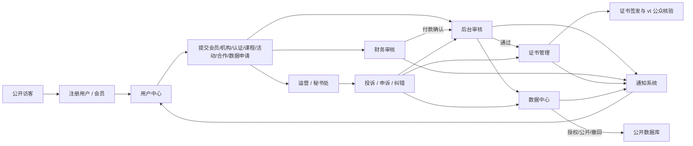
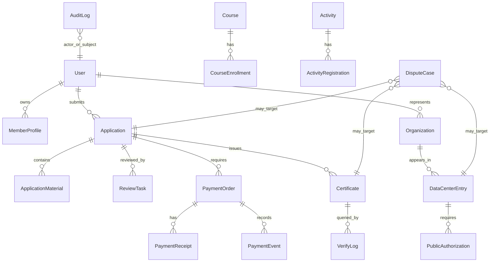

# ITCA 全业务泳道图与对象关系图 v1.1

## A. 全业务泳道图

覆盖流程：个人会员申请、机构会员申请、道教文化认证/道士认证建档、付款与财务审核、证书签发与公众核验、数据中心建档授权公开撤回、合作线索项目归档、投诉申诉纠错。

## B. 核心业务对象关系图

## C. 关系说明

- User 与 MemberProfile：一个用户可拥有会员档案；机构负责人可代表机构。
- Application 是会员、机构、认证、课程、合作和数据提交的统一申请抽象。
- PaymentOrder 不直接代表业务通过，只代表应收款与付款确认。
- PaymentEvent 记录凭证驳回、确认收款、重复付款、退款、取消订单和作废订单，必要时关联 AuditLog。
- Certificate 由 Application 审核通过后生成，公众访问详情必须遵循 vt 核验。
- DataCenterEntry 公开前必须关联 PublicAuthorization。
- DisputeCase 可关联证书、申请、数据条目、订单、课程或活动。
- AuditLog 关联所有关键业务对象，高风险操作必须留痕。

后台 SaaS 化管理要求所有业务对象有编号、状态、详情页时间线、下一步动作、通知记录、关联对象和审计记录；异常进入待办或争议与风控模块，删除原则上改为归档、作废或隐藏。
