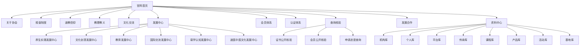
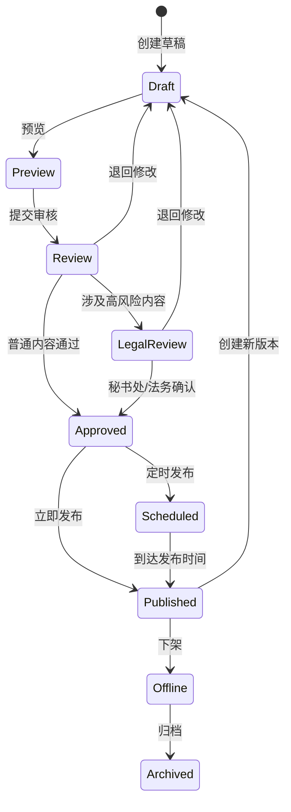
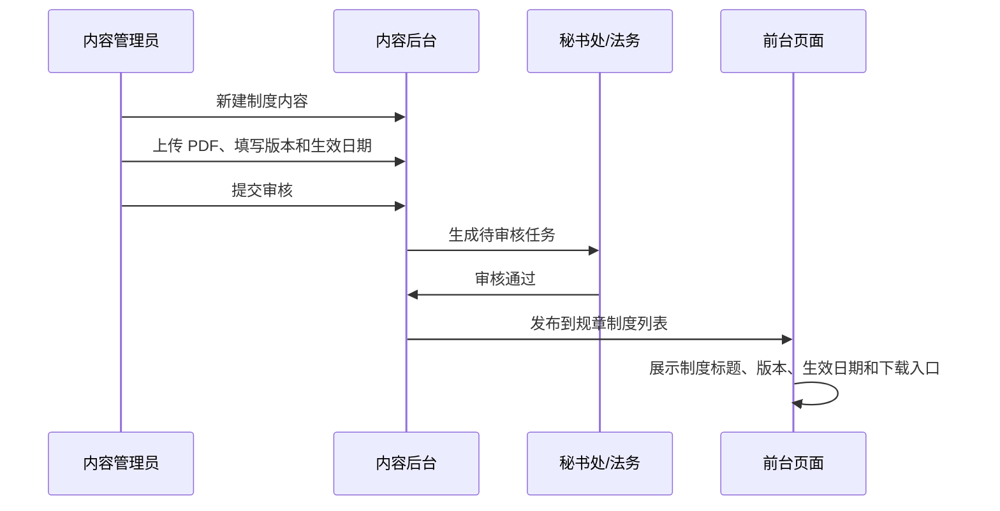
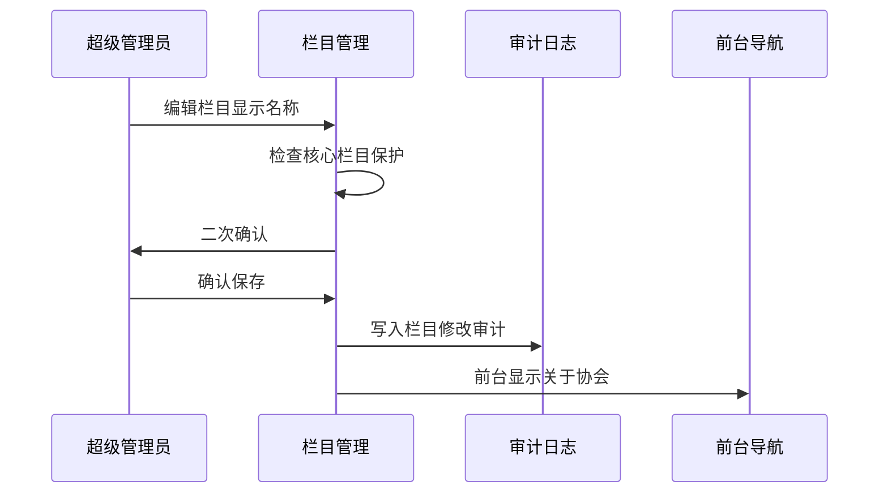
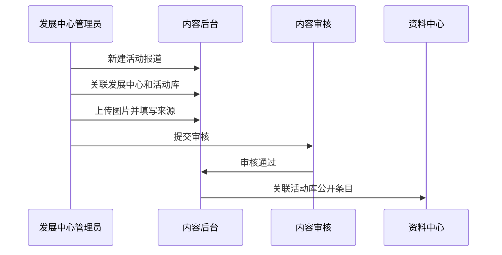

# ITCA 官网导航栏目与频道 CMS 交互原型说明 v1.1

## 1. 文档信息

| 项目 | 内容 |
| --- | --- |
| 文档名称 | ITCA 官网导航栏目与频道 CMS 交互原型说明 v1.1 |
| 日期 | 2026-06-11 |
| 状态 | 低保真交互原型说明，待评审 |
| 适用范围 | 前台顶部导航、频道栏目页、后台栏目管理、页面编辑器、版式库、审核发布 |
| 交付方式 | Markdown 原型说明 + 静态 HTML 可点击原型 |
| 边界 | 不做本地开发，不改业务代码，不改数据库 |

## 2. 原型目标

本原型用于回答四个问题：

1. 顶部导航栏目如何组织，尤其是“介绍”如何改为“关于协会”。
2. 每个频道页面应该长什么样，哪些内容可由后台维护。
3. 后台 CMS 如何管理栏目、页面、区块、内容、媒体、审核和版本。
4. CMS 配置如何不破坏申请、查询、核验、支付、证书 vt 和公开 DTO 等既有业务逻辑。

## 3. 原型页面清单

### 3.1 前台页面

| 编号 | 页面 | 路径 | 原型重点 |
| --- | --- | --- | --- |
| F01 | 首页 | `/` | 核心入口、公告、发展中心推荐、查询入口 |
| F02 | 关于协会 | `/intro`，兼容 `/about` | 协会简介、宗旨使命、组织架构、发展历程 |
| F03 | 规章制度 | `/rules` | 制度分类、制度列表、PDF、版本、生效日期 |
| F04 | 道教信仰 | `/faith` | 文化主题、文章专题、术语解释、边界说明 |
| F05 | 教理教义 | `/doctrine` | 经典导读、思想主题、学习路径、课程关联 |
| F06 | 文化交流 | `/exchange` | 动态、活动报道、项目展示、合作入口 |
| F07 | 发展中心 | `/development` | 六大发展中心入口 |
| F08 | 发展中心详情 | `/development/{slug}` | 中心定位、项目、课程活动、合作机构、成果 |
| F09 | 会员体系 | `/membership` | 会员类型、权益、申请流程、续期说明 |
| F10 | 认证体系 | `/certification` | 认证类型、材料、审核流程、证书说明、边界 |
| F11 | 查询核验 | `/certificate-query`，后续可聚合 `/verification` | 证书、会员、申请进度查询入口 |
| F12 | 发展合作 | `/cooperation` | 合作类型、流程、案例、提交说明 |
| F13 | 资料中心 | `/data` | 八类数据库、公开字段、纠错撤回 |
| F14 | 文章/公告/制度详情 | `/announcements/{slug}` 或后续内容详情路径 | 标题、正文、附件、版本、关联内容 |

### 3.2 后台页面

| 编号 | 页面 | 路径建议 | 原型重点 |
| --- | --- | --- | --- |
| A01 | CMS 工作台 | `/admin/content` | 待审核、草稿、近期发布、风险提醒 |
| A02 | 栏目管理 | `/admin/content/channels` | 顶部导航、二级导航、路径、排序、显示状态 |
| A03 | 页面管理 | `/admin/content/pages` | 频道页列表、状态、预览、编辑入口 |
| A04 | 页面编辑器 | `/admin/content/pages/{id}/edit` | 区块树、预览、属性面板、保存、提交审核 |
| A05 | 版式库 | `/admin/content/block-library` | Hero、卡片组、列表、FAQ、边界说明等受控版式 |
| A06 | 内容库 | `/admin/content/items` | 文章、公告、制度、FAQ、活动报道 |
| A07 | 媒体库 | `/admin/content/assets` | 图片、PDF、附件、alt、来源、授权说明 |
| A08 | 审核发布 | `/admin/content/reviews` | 待审核、待法务、待秘书处、定时发布 |
| A09 | 版本记录 | `/admin/content/revisions` | 历史版本、差异、回滚申请 |
| A10 | 内容权限 | `/admin/roles` 和 `/admin/permissions` | 内容角色、栏目权限、发布权限 |

## 4. 信息架构原型



## 5. 前台顶部导航交互

### 5.1 桌面端导航线框

```text
┌──────────────────────────────────────────────────────────────────────────────┐
│ 道法自然 · 和合共生 · 弘道传承 · 文化互鉴 · 共创未来                         │
├──────────────────────────────────────────────────────────────────────────────┤
│ ITCA 国际道教与文化协会                                                      │
│ [首页] [关于协会] [规章制度] [道教信仰] [教理教义] [文化交流] [发展中心 ▾]   │
│ [会员体系] [认证体系] [查询核验] [发展合作] [资料中心]             [登录][注册] │
└──────────────────────────────────────────────────────────────────────────────┘
```

交互规则：

- 点击“关于协会”进入 `/intro`，显示名称为“关于协会”。
- 鼠标悬停“发展中心”展示六个二级栏目。
- 当前路径对应的一级栏目高亮。
- 点击“查询核验”短期仍进入 `/certificate-query`，后续可进入聚合页。
- 登录/注册固定在导航右侧。
- 核心导航隐藏或改路径需要后台二次确认。

### 5.2 移动端导航线框

```text
┌──────────────────────────────┐
│ ITCA 国际道教与文化协会  登录 │
├──────────────────────────────┤
│ 横向滑动导航                  │
│ 首页 关于协会 规章制度 信仰... │
└──────────────────────────────┘
```

交互规则：

- 移动端先保留横向滑动导航。
- 后续可升级为“菜单按钮 + 分组抽屉”。
- 二级栏目在移动端不使用悬停，进入发展中心首页后展示二级入口。

## 6. 通用频道页原型

```text
┌──────────────────────────────────────────────────────┐
│ Header 顶部导航                                      │
├──────────────────────────────────────────────────────┤
│ Hero                                                 │
│  栏目标题                                            │
│  栏目简介                                            │
│  [主操作按钮] [次操作按钮]                            │
│  背景图 / 主视觉                                     │
├──────────────────────────────────────────────────────┤
│ 栏目导语                                             │
│  频道定位、适用对象、内容边界                         │
├──────────────────────────────────────────────────────┤
│ 区块 1：卡片组 / 分类入口                             │
│ [卡片] [卡片] [卡片]                                 │
├──────────────────────────────────────────────────────┤
│ 区块 2：列表 / 图文 / 时间线 / FAQ                     │
│ 可由后台版式库添加                                    │
├──────────────────────────────────────────────────────┤
│ 边界说明 / 推荐入口 / 关联内容                         │
└──────────────────────────────────────────────────────┘
```

所有频道页都应具备：

- SEO 信息。
- Hero。
- 栏目导语。
- 受控内容区块。
- 发布状态。
- 审核记录。
- 版本记录。
- 高风险栏目边界说明。

## 7. 重点频道线框

### 7.1 关于协会

```text
Hero：关于协会
  简介：协会定位、服务对象、官网功能边界
  操作：了解会员体系 / 联系合作

区块 1：协会简介
  协会宗旨、使命、价值观、国际视野

区块 2：组织架构
  理事会 / 秘书处 / 认证委员会 / 专家顾问委员会 / 六大发展中心

区块 3：服务对象
  会员 / 认证申请人 / 机构伙伴 / 文化学习者 / 国际交流对象

区块 4：发展历程
  时间线，可后台新增年份和事件
```

### 7.2 规章制度

```text
Hero：规章制度
  操作：申请进度查询 / 证书公开核验

区块 1：制度分类
  协会章程 / 会员规则 / 认证规则 / 证书核验 / 资料公开 / 合作规则 / 投诉申诉

区块 2：制度列表
  标题 | 编号 | 版本 | 生效日期 | 状态 | PDF

区块 3：重点制度摘要
  认证边界、隐私规则、退款和争议规则

区块 4：修订记录
  版本时间线
```

### 7.3 发展中心详情

```text
Hero：教育发展中心
  简介：课程研修、师资交流、学习档案
  操作：查看课程 / 申请合作

区块 1：中心定位
区块 2：专委会 / 工作组
区块 3：项目与计划
区块 4：课程活动
区块 5：合作机构
区块 6：成果展示
区块 7：数据沉淀
```

### 7.4 查询核验

```text
Hero：查询核验
  说明：所有核验结果以官网当前公开信息为准

入口卡片：
  [证书公开核验] 证书编号 + 持证人姓名
  [会员公开核验] 会员编号 + 姓名/机构名称
  [申请进度查询] 申请编号 + 登记联系方式

边界说明：
  公开核验不展示联系方式、材料、后台备注、Storage path
```

CMS 可管理：入口文案、边界提示、FAQ。

CMS 不可管理：查询字段、接口、DTO、安全校验、vt 规则。

## 8. 后台 CMS 工作台原型

```text
┌──────────────────────────────────────────────────────────────┐
│ 后台 Header：内容管理                                      │
├───────────────┬──────────────────────────────────────────────┤
│ Sidebar        │ 工作台                                      │
│ - CMS 工作台   │ [待审核 12] [待法务 3] [草稿 28] [已发布 96] │
│ - 栏目管理     │                                              │
│ - 页面管理     │ 待处理任务                                   │
│ - 内容库       │  1. 规章制度 V1.1 待秘书处确认               │
│ - 版式库       │  2. 道医中医文化发展中心内容待合规确认        │
│ - 媒体库       │  3. 关于协会页面主视觉待替换                 │
│ - 审核发布     │                                              │
│ - 版本记录     │ 最近发布                                     │
└───────────────┴──────────────────────────────────────────────┘
```

## 9. 栏目管理原型

```text
栏目管理

[新增栏目] [保存排序] [预览前台导航]

┌────┬──────────┬──────────────┬──────┬──────┬────────────┬────────┐
│排序│显示名称  │路径          │显示  │保护  │发布状态    │操作    │
├────┼──────────┼──────────────┼──────┼──────┼────────────┼────────┤
│01  │首页      │/             │是    │是    │已发布      │编辑    │
│02  │关于协会  │/intro        │是    │是    │已发布      │编辑    │
│03  │规章制度  │/rules        │是    │是    │已发布      │编辑    │
│07  │发展中心  │/development  │是    │是    │已发布      │二级菜单│
└────┴──────────┴──────────────┴──────┴──────┴────────────┴────────┘
```

交互规则：

- “关于协会”显示名可编辑。
- `/intro` 路径短期保留，后续可申请规范化到 `/about`。
- 修改受保护栏目路径或隐藏状态，需要二次确认并写入审计。
- 发展中心支持二级菜单管理。

## 10. 页面编辑器原型

```text
┌──────────────────────────────────────────────────────────────────────────────┐
│ 页面编辑器：关于协会                                      [保存草稿][预览][提交审核] │
├─────────────────┬───────────────────────────────────────┬──────────────────┤
│ 区块树           │ 页面预览                              │ 属性面板          │
│ 1 Hero           │ ┌───────────────────────────────────┐ │ 当前区块：Hero    │
│ 2 协会简介       │ │ 关于协会                            │ │ 标题              │
│ 3 组织架构       │ │ 协会简介和主按钮                     │ │ 简介              │
│ 4 服务对象       │ └───────────────────────────────────┘ │ 背景图            │
│ 5 发展历程       │ ┌───────────────────────────────────┐ │ 主按钮            │
│ + 添加区块       │ │ 协会简介区块                         │ │ 次按钮            │
│                 │ └───────────────────────────────────┘ │ 显示/隐藏         │
└─────────────────┴───────────────────────────────────────┴──────────────────┘
```

核心交互：

- 点击区块树选中区块。
- 拖拽或输入排序调整区块顺序。
- 点击“添加区块”打开版式库。
- 切换“桌面预览 / 移动预览”。
- 保存草稿不影响前台。
- 提交审核后进入审核发布队列。
- 已发布页面修改后生成新草稿版本，不直接覆盖线上版本。

## 11. 版式库弹窗原型

```text
添加区块

[Hero 首屏] [卡片组] [富文本] [图文区块] [时间线]
[文件下载列表] [FAQ] [公告列表] [文章列表] [活动课程列表]
[数据库入口组] [边界说明框] [CTA 操作区]
```

限制规则：

- 版式库由系统预设，不允许普通内容管理员自定义 HTML。
- 高风险区块必须绑定边界说明。
- 查询表单、申请表单和支付表单不作为 CMS 区块直接编辑。

## 12. 审核发布流程原型



## 13. 前后台交互流程

### 13.1 新增一个规章制度文件



### 13.2 修改顶部导航“介绍”为“关于协会”



### 13.3 添加发展中心活动报道



## 14. 权限交互

| 操作 | 内容管理员 | 发展中心管理员 | 秘书处管理员 | 法务/合规 | 超级管理员 |
| --- | --- | --- | --- | --- | --- |
| 编辑普通文章 | 可 | 可编辑本中心 | 可 | 只读/审核 | 可 |
| 编辑顶部导航 | 不可 | 不可 | 申请修改 | 不可 | 可 |
| 编辑关于协会 | 可提交 | 不可 | 可审核 | 可审核高风险 | 可 |
| 发布普通内容 | 提交审核 | 提交审核 | 可发布 | 可发布合规内容 | 可 |
| 发布高风险内容 | 不可直接发布 | 不可直接发布 | 需确认 | 需确认 | 可 |
| 下架内容 | 提交申请 | 提交申请 | 可 | 可建议 | 可 |
| 回滚版本 | 不可 | 不可 | 可申请 | 可申请 | 可 |
| 删除内容 | 不建议开放 | 不建议开放 | 不建议开放 | 不建议开放 | 仅逻辑删除或归档 |

## 15. 关键交互验收

- “介绍”可在导航显示为“关于协会”。
- 栏目管理支持排序、显示/隐藏、二级栏目和核心路径保护。
- 页面编辑器支持区块树、预览、属性面板和版式库添加。
- 页面修改先保存草稿，不直接覆盖已发布版本。
- 高风险内容必须进入秘书处/法务确认。
- 规章制度支持版本、生效日期、PDF、修订记录。
- 发展中心支持二级频道和中心详情页内容维护。
- 查询核验页的业务表单和接口安全规则不能被 CMS 修改。
- 移动端导航可用，不依赖 hover 才能访问二级栏目。
- 所有发布、下架、路径修改和核心栏目隐藏都写入审计。

## 16. 与静态可点击原型对应关系

| 文档原型 | HTML 原型中的位置 |
| --- | --- |
| 顶部导航 | 前台频道视图顶部导航 |
| 通用频道页 | 前台频道预览区 |
| 栏目管理 | 后台 CMS 的“栏目管理”面板 |
| 页面编辑器 | 后台 CMS 的“页面编辑器”面板 |
| 版式库 | 页面编辑器右侧“添加区块”交互 |
| 审核发布 | 后台 CMS 的“审核发布”面板 |
| 移动端导航 | “移动端预览”面板 |

